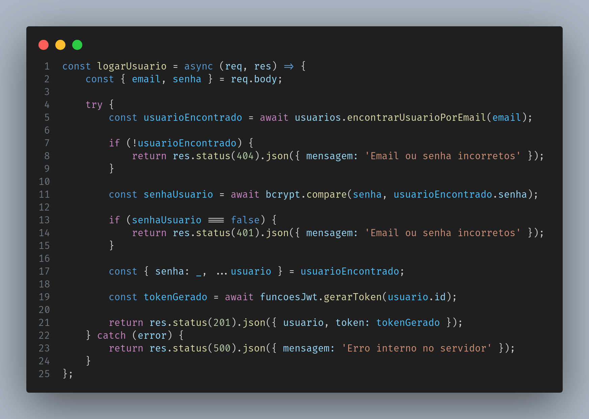
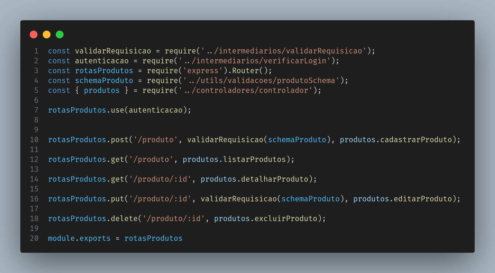
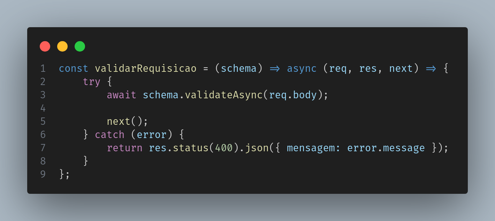

# Code X Code - PDV

O projeto PDV da CodeXCode é um projeto focado em fornecer um sistema Ponto de Venda (PDV).


## Funcionalidades

- Gerenciar usuários
    - Criar conta com senha criptografada via bcrypt.
        - Conta é salva no banco de dados, o banco de dados utilizado nesse projeto é o PostgreSQL
    - Logar no sistema com segurança
        - Autenticação é feita via JSON Web Token
- Visualizar categorias das vendas
- Gerenciar clientes
    - Cadastrar novos clientes
    - Listar clientes cadastrados
    - Atualizar dados dos clientes
- Gerenciar produtos
    - Cadastrar novos produtos
    - Listar produtos cadastrados
    - Atualizar produtos cadastrados
    - Deletar produtos cadastrados


## Dependencias

node: v18.17.1 ou LTS

npm: 9.6.7  ou LTS


## Como rodar o projeto localmente

Navegue até a pasta onde baixou/clonou o projeto 

```CLI
.../desafio-backend-modulo-05-sistema-pdv-b2b-ifood-t08
```

Esse comando irá instalar as dependencias no diretório local
```CLI
npm install
```

Você deverá criar um arquivo .env na raiz do projeto (desafio-backend-modulo-05-sistema-pdv-b2b-ifood-t08/.env)
```.env
PORT= porta local que será utilizada pelo app

BD_HOST= host do seu banco de dados
BD_PORT= porta do seu banco de dados
BD_USER= usuário do seu banco de dados
BD_PASS= senha do seu banco de dados
BD_NAME= nome do seu banco de dados

JWT_PASS= senha que será utilizada nos processos de criptografia

SSL_TOGGLE= recebe dois valores true ou false OBS: Essa variável foi uma solução para não precisar alterar o código sempre que fosse ser testado localmente ou em produção, caso esteja utilizando um banco de dados online use o valor true.

Abaixo estão as credenciais que utilizamos com o provedor backblaze, dependendo do seu serviço de armazenamento as variáveis de ambiente podem diferir. Recomendamos que sigam a documentação do serviço que esteja utilizando.
KEY_ID=
BUCKET_NAME=
APP_KEY=
ENDPOINT_BACKBLAZE=

Exemplo de credenciais de serviço de envio de emails.
MAIL_HOST=
MAIL_PORT=
MAIL_USER=
MAIL_PASS=
MAIL_NAME= nome da sua organização ou seu nome
MAIL_FROM= remetente
```

Agora que você já configurou tudo que era necessário rode esse comando para iniciar o app:
```CLI
npm start
```
Você deverá ler a seguinte mensagem no seu terminal:
```CLI
Servidor rodando na porta: ${porta definida no arquivo .env PORT}
```


## Capturas de tela

Função de autenticação


Endpoints de produtos


Validação modularizada do corpo da requisição



## Escopo do projeto

Para entender melhor sobre o projeto, suas motivações e outras informações acesse o [Escopo](./escopo.md). Estão presentes informações sobre as rotas, delimitações do usuário, regras de negócio e etc. 
